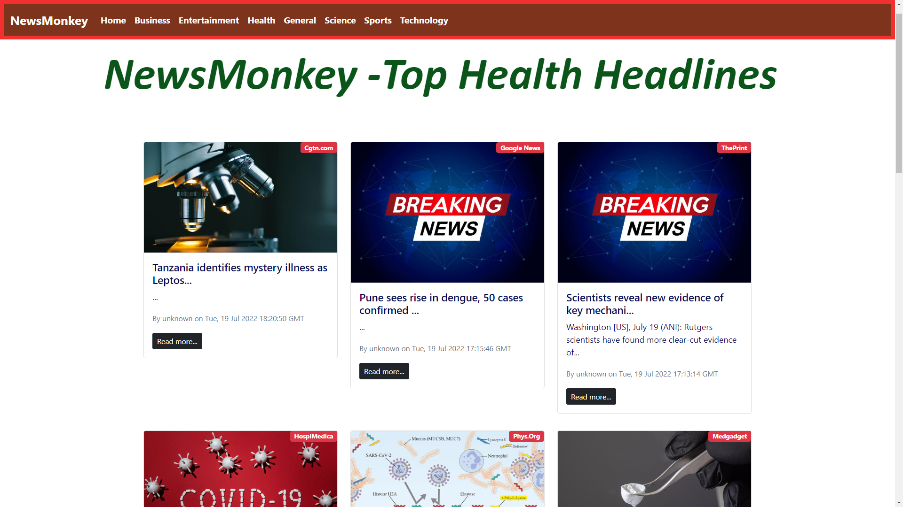
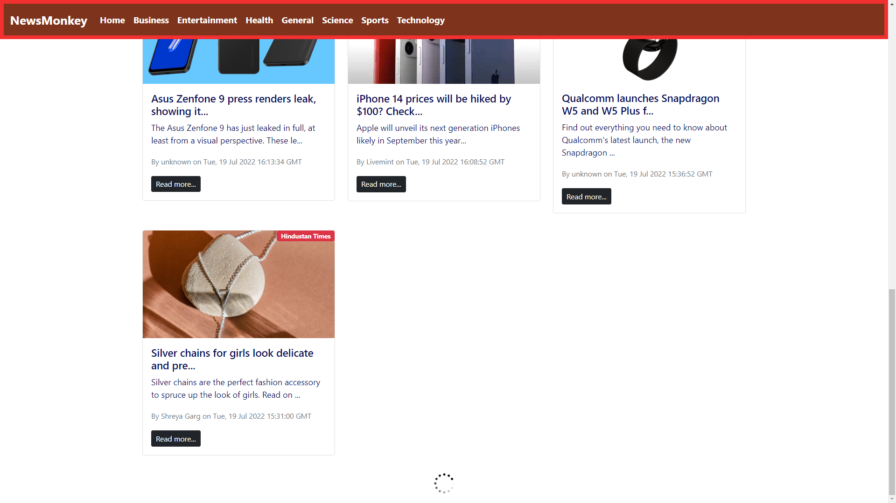

# Netted - Latest News Anywhere Anytime
## **Tech Stack** : 
* HTML
* CSS
* JavaScript
* React Js
* Git / GitHub
___
## **Description** : 
* News on the go
* Categorised on basis of various topics like Business, Entertainment, Health, Science, Sports and Technology
* Latest news with date and author name from a lot of different sources
* Completely free
___
## **Previews** : 
### Home Page (Top Headlines from all Categories)

### Business Category

### Entertainment Category

### Health Category

### Science Category

### Sports Category

### Technology Category

### Loading Spinner

### Loading Bar


___
## **Download Links** : 
You can access my project from your local machine !
>https : https://github.com/ftharsh/Netted

```bash
    git clone https://github.com/ftharsh/Netted.git
```
___
